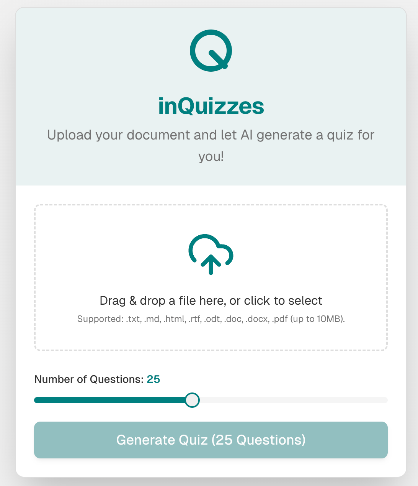

# inQuizzes

Upload your document and let AI generate a quiz for you!

**inQuizzes is designed to help students test their knowledge based on their own sources.**

---

## Live Demo
[inQuizzes.dougget.com](https://inquizzes.dougget.duckdns.org/)

---

## Screenshot



---

## Features
- Upload your own documents (.txt, .md, .html, .rtf, .odt, .doc, .docx, .pdf)
- AI generates quizzes based on your uploaded content
- Adjustable number of questions
- Simple and intuitive interface

---

## Getting Started

### Prerequisites
- [Docker](https://www.docker.com/) installed on your machine
- [Free Google Gemini API KEY] (https://aistudio.google.com/app/apikey)
### Running with Docker
1. Clone this repository:
   ```bash
   git clone <repo-url>
   cd inQuizzes
   ```
2. Build the Docker image:
   ```bash
   docker build -t inquizzes .
   ```
3. Create .env entry for your gemini-2.0-flash API key containing the following line:
   ```bash
   GOOGLE_API_KEY=YOURGEMINI-2.0-FLASH-APIKEY
   ```   
4. Run the Docker container:
   ```bash
   docker run -p 3000:3000 inquizzes
   ```
5. Open your browser and go to [http://localhost:3000](http://localhost:3000) - The ports can be modified in your .env file.

---

## Technical Details
- Built with Next.js and TypeScript
- Supports file uploads up to 10MB
- Supported file types: `.txt`, `.md`, `.html`, `.rtf`, `.odt`, `.doc`, `.docx`, `.pdf`

---

## Contributing
Pull requests are welcome! For major changes, please open an issue first to discuss what you would like to change.

---

## License
[MIT](LICENSE)
